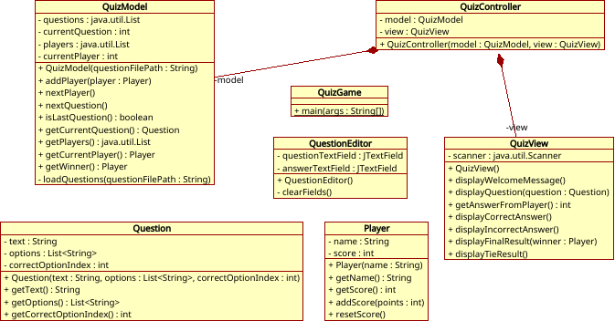

# Quiz Application

> A comprehensive Java Swing-based quiz game with MVC architecture, two-player mode, score tracking, and quiz question management. Supports editing quiz questions and storing them in text and JSON formats.

[](https://opensource.org/licenses/MIT)
[](https://www.oracle.com/java/)
[](https://maven.apache.org/)

## Overview

Quiz is an educational Java desktop application designed to demonstrate professional software development practices and design patterns. It features a complete quiz game experience with:

- **Two-Player Mode**: Competitive quiz experience for multiple players
- **Score Tracking**: Persistent score tracking and game history
- **Quiz Management**: Built-in editor for creating and managing quiz questions
- **Multiple Storage Formats**: Support for text and JSON formats
- **MVC Architecture**: Clean separation of concerns using the Model-View-Controller pattern
- **User-Friendly UI**: Professional Java Swing-based graphical interface

## Architecture

### MVC Pattern


The application follows the MVC (Model-View-Controller) pattern to maintain clean code organization:
- **Model**: Manages quiz data, questions, players, and scores
- **View**: Java Swing UI components for user interaction
- **Controller**: Handles user input and coordinates between model and view

### Class Diagram



*Class diagram created with [Umbrello UML Editor](https://github.com/KDE/umbrello)*

## Key Topics and Technologies

This project demonstrates the following concepts and technologies:

- [x] Object-Oriented Programming (OOP) with Java
- [x] UML Design and Class Diagrams
- [x] Collections Framework (List, Map, Set)
- [x] File I/O and Stream Processing
- [x] Model-View-Controller (MVC) Architecture
- [x] Java Swing GUI Framework
- [x] JSON Processing
- [x] Exception Handling
- [x] Software Design Patterns

## Getting Started

### Prerequisites

- **Java**: JDK 11 or higher
- **Maven**: 3.6.0 or higher

### Quick Start

```bash
# Clone the repository
git clone https://github.com/club-mate/Quiz
cd Quiz

# Build the project
mvn clean package

# Run the application
java -jar target/quiz-app-1.0.0.jar
```

### Detailed Build Instructions

For comprehensive build instructions, compilation options, and troubleshooting, please refer to [BUILD.md](BUILD.md).

## Project Structure

```
Quiz/
├── src/
│   ├── main/
│   │   └── java/
│   │       └── com/quiz/
│   │           ├── model/       # Data models and business logic
│   │           ├── view/        # Swing UI components
│   │           └── controller/  # User input handling
│   └── test/
│       └── java/               # Unit tests
├── docs/                        # Documentation and diagrams
├── pom.xml                      # Maven configuration
├── BUILD.md                     # Detailed build instructions
├── CONTRIBUTING.md              # Contribution guidelines
├── CODE_OF_CONDUCT.md          # Code of conduct
└── README.md                    # This file
```

## Documentation

- **[BUILD.md](BUILD.md)** - Detailed build and compilation instructions
- **[ARCHITECTURE.md](ARCHITECTURE.md)** - System architecture and design decisions
- **[CONTRIBUTING.md](CONTRIBUTING.md)** - Contribution guidelines for developers
- **[CODE_OF_CONDUCT.md](CODE_OF_CONDUCT.md)** - Community standards and conduct
- **[SUPPORT.md](SUPPORT.md)** - Support channels and resources

## Usage

### Playing the Quiz

1. Launch the application
2. Create or load a quiz file (text or JSON format)
3. Invite a second player
4. Start the quiz and answer questions
5. View final scores and statistics

### Creating Quiz Questions

Use the built-in quiz editor to:
- Add new questions and answers
- Define correct answers
- Manage question categories
- Export/import quiz files

## Contributing

We welcome contributions! Please see [CONTRIBUTING.md](CONTRIBUTING.md) for guidelines on:
- How to report bugs
- How to suggest features
- How to submit pull requests
- Code style and standards

## License

This project is licensed under the MIT License - see the [LICENSE](LICENSE) file for details.

```
MIT License

Copyright (c) 2024 club-mate

Permission is hereby granted, free of charge, to any person obtaining a copy
of this software and associated documentation files (the "Software"), to deal
in the Software without restriction, including without limitation the rights
to use, copy, modify, merge, publish, distribute, sublicense, and/or sell
copies of the Software, and to permit persons to whom the Software is
furnished to do so, subject to the following conditions:

The above copyright notice and this permission notice shall be included in all
copies or substantial portions of the Software.
```

## Support

For support, questions, or feature requests, please refer to [SUPPORT.md](SUPPORT.md) or open an issue on the [GitHub repository](https://github.com/club-mate/Quiz/issues).

## Acknowledgments

- [Umbrello UML Editor](https://github.com/KDE/umbrello) - Used for creating class diagrams
- Java Swing Framework - For the UI components
- Maven - For build automation
