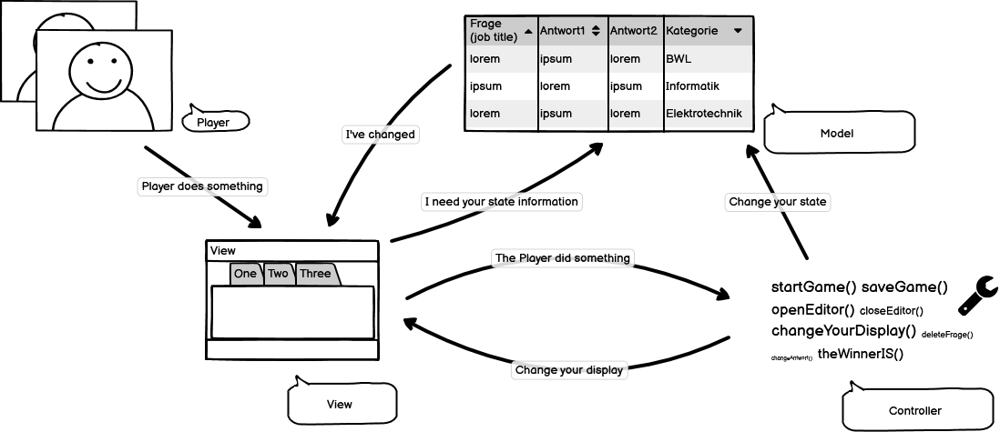

# Quiz

> Wissensquiz mit Java Swing UI (MVC), 2 Spieler Modus, Spielständen und QuizFragen, welchen in Textdateien gespeichert werden. Quizfragen sollen in einem Editor bearbeitet werden können. (Nice to Have: Quizfragen im JSON Format)

<!-- [](https://travis-ci.org/badges/badgerbadgerbadger) -->
[](http://badges.mit-license.org) 



## In diesem Projekt behandelte Themen

- [x] OOP Java
- [x] UML
- [x] Collections
- [x] File / Buffer
- [x] MVC
- [x] Swing

## Projekt

[https://github.com/users/club-mate/projects/1](https://github.com/users/club-mate/projects/1)

## Doku

[https://github.com/club-mate/Quiz/tree/master/docs](https://github.com/club-mate/Quiz/tree/master/docs)

## Klonen
* Clone this repo to your local machine using 
```bash 
git clone https://github.com/club-mate/Quiz
```
## Mitmachen

[https://github.com/club-mate/Quiz/tree/master/contribute.md](https://github.com/club-mate/Quiz/tree/master/contribute.md)

## Lizenz
[](http://badges.mit-license.org) 
* [MIT licence](http://opensource.org/licenses/mit-license.php)
